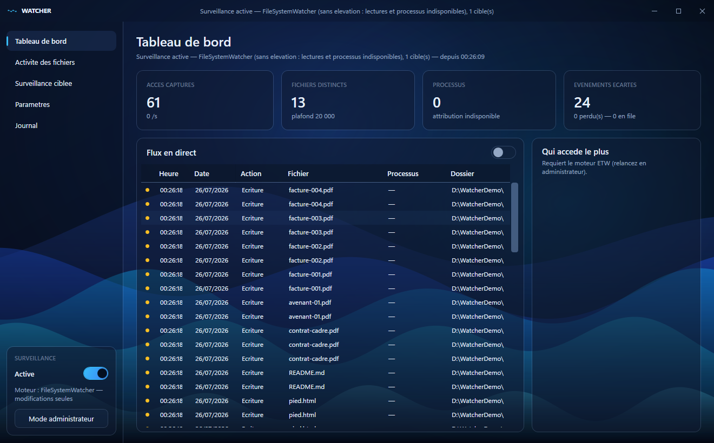
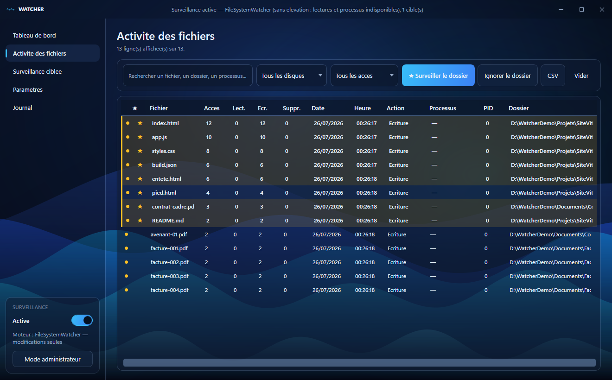
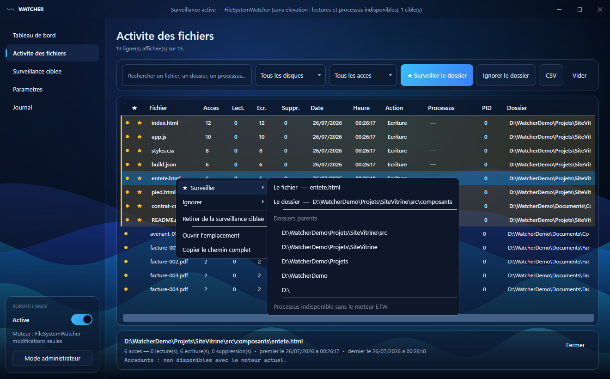
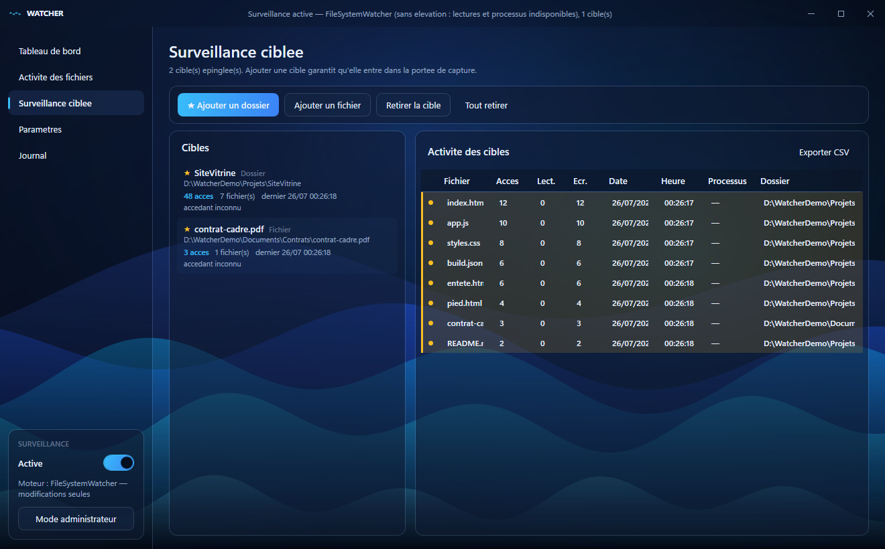
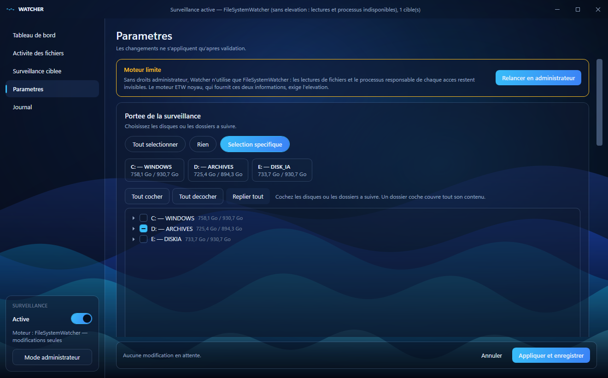
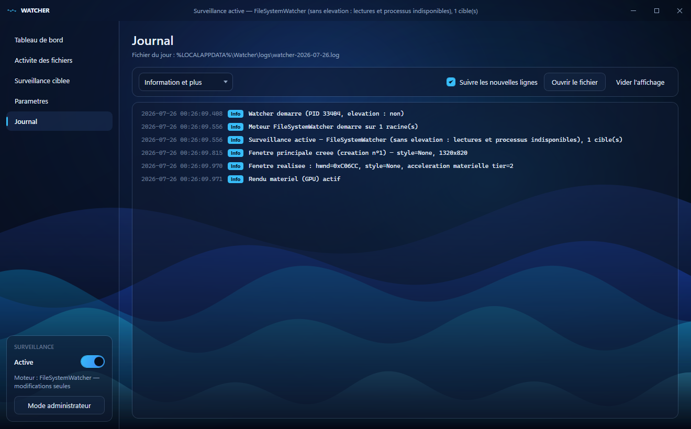

# Watcher

Surveillance des accès aux fichiers de vos disques, en tâche de fond, avec icône dans la
zone de notification. Interface WPF sombre à fond de vagues animées.

Watcher répond à une question simple : **qu'est-ce qui touche à mes fichiers, et quand ?**
Il liste chaque fichier accédé avec la date, l'heure, le nombre d'accès et — sous certaines
conditions — le processus responsable.



---

## Sommaire

- [Installation](#installation)
- [Le point à comprendre : les deux moteurs](#le-point-à-comprendre--les-deux-moteurs)
- [Les écrans](#les-écrans)
  - [Tableau de bord](#tableau-de-bord)
  - [Activité des fichiers](#activité-des-fichiers)
  - [Le menu contextuel](#le-menu-contextuel)
  - [Surveillance ciblée](#surveillance-ciblée)
  - [Paramètres](#paramètres)
  - [Journal](#journal)
- [Réduire le bruit](#réduire-le-bruit)
- [Emplacement des données](#emplacement-des-données)
- [Notes de fonctionnement](#notes-de-fonctionnement)
- [Compiler](#compiler)

---

## Installation

```
publish.cmd
```

Produit `dist\Watcher.exe` : **un seul fichier autonome** (~68 Mo, le runtime .NET est
embarqué). Rien à installer, copiable où vous voulez.

Au premier lancement, Watcher se replie directement dans la zone de notification, la
surveillance à l'arrêt. **Clic gauche sur l'icône** pour ouvrir la fenêtre. La croix de la
fenêtre replie dans le tray ; pour quitter réellement, clic droit sur l'icône → **Quitter**.

Prérequis pour compiler : .NET 9 SDK. Aucun prérequis pour exécuter l'exe publié.

---

## Le point à comprendre : les deux moteurs

C'est la clé pour bien se servir de Watcher.

| | Sans administrateur | **En administrateur** |
|---|---|---|
| Moteur | `FileSystemWatcher` | **Session ETW noyau** |
| Écritures, créations, suppressions, renommages | oui | oui |
| **Lectures de fichiers** | non | **oui** |
| **Processus responsable (nom + PID)** | non | **oui** |

Savoir *qui* accède à un fichier n'est possible qu'en interrogeant le noyau via ETW, ce qui
**exige l'élévation**. Watcher démarre donc sans UAC en mode dégradé et propose un bouton
**Mode administrateur** qui le relance élevé. Un badge `ADMIN` apparaît alors dans la barre
de titre.

Le moteur réellement actif est toujours affiché dans la barre de titre, dans le panneau de
gauche, et écrit dans le journal au démarrage — vous n'avez jamais à deviner dans quel mode
vous êtes.

> Les captures de ce document ont été prises **sans élévation** : la colonne « Processus »
> y affiche donc `—`. En mode administrateur, elle se remplit avec le nom et le PID du
> processus accédant.

---

## Les écrans

### Tableau de bord


Quatre compteurs, le flux en direct et le classement des processus.

- **Accès capturés** et cadence instantanée
- **Fichiers distincts**, avec le plafond configuré
- **Processus** observés, ou l'indication que l'attribution est indisponible
- **Événements écartés** — ceux qu'un filtre a rejetés, et ceux perdus en cas de rafale

Le **flux en direct** horodate chaque événement avec une pastille de couleur par type
d'accès (lecture, écriture, création, suppression, renommage). L'interrupteur le gèle pour
lire tranquillement sans que les lignes défilent.

Dans cette capture, les **45 événements écartés** correspondent au dossier `Cache`, exclu
par configuration : la preuve visible que le filtre travaille.

### Activité des fichiers



Un fichier par ligne, agrégé : nombre d'accès, détail lectures / écritures / suppressions,
date et heure du dernier accès, dernière action, processus accédants, PID et dossier.

Les lignes **surveillées** se repèrent immédiatement : fond ambré, liseré à gauche, libellé
en demi-gras et colonne **★** triable. Ici, les 8 fichiers du projet `SiteVitrine` et le
contrat épinglé ressortent des factures ordinaires.

Recherche libre (nom, dossier ou processus), filtre par disque et par type d'accès.
Sélectionner une ligne ouvre un volet d'inspection avec le chemin complet, le premier et le
dernier accès, et le détail de tous les accédants avec leur nombre de hits. `CSV` exporte
les lignes affichées, avec BOM UTF-8 pour qu'Excel garde les accents.

### Le menu contextuel



Un clic droit ouvre deux sous-menus symétriques, **★ Surveiller** et **Ignorer**, construits
à la volée d'après la ligne visée :

- **Le fichier** — la ligne elle-même
- **Le dossier** — son dossier direct
- **Dossiers parents** — toute la chaîne jusqu'à la racine du volume
- **Le processus** — chaque processus ayant réellement touché ce fichier

La **chaîne des parents** évite de remonter à la main quand la ligne est profondément
enfouie : un clic suffit pour viser le bon niveau. Les chemins longs sont raccourcis par le
milieu pour garder le menu lisible.

Les entrées **processus** n'existent qu'avec le moteur ETW ; sans lui, le menu l'indique
explicitement plutôt que de rester vide — c'est le cas sur la capture.

Sur une sélection multiple, « Le fichier » s'applique à toutes les lignes ; un dossier ou un
processus reste une cible unique et explicite.

### Surveillance ciblée



Vos dossiers, fichiers et processus épinglés, suivis à part. Chaque cible affiche son
nombre d'accès, ses fichiers distincts, son dernier accès et son accédant principal ; la
sélectionner filtre le tableau de droite sur elle seule.

Pour une cible **processus**, les compteurs ne retiennent **que les accès de ce processus**,
pas tous ceux des fichiers qu'il touche.

**« Surveiller » ne se contente pas de filtrer** — la cible est *garantie observée* :

- si un motif d'exclusion la bloquait, il est **levé** (sinon la cible resterait muette) ;
- si elle n'était pas dans la portée de capture, la portée est **étendue** ;
- si la portée était **Rien**, elle bascule en **Sélection spécifique** ;
- surveiller un processus explicitement ignoré le **retire des ignorés**, et inversement —
  les deux listes ne peuvent pas se contredire.

Chaque ajustement est indiqué à l'écran et écrit dans le journal : aucun changement de
configuration n'est silencieux.

### Paramètres



**Portée** en trois modes : **Tout sélectionner** (tous les disques fixes), **Rien**, ou
**Sélection spécifique** via une arborescence à cases **tri-état**. L'arbre se charge à la
demande, dossier par dossier : ouvrir `C:` ne parcourt pas le disque entier. Un dossier
coché couvre tout son contenu ; une sélection partielle s'affiche en tiret — visible ici sur
le disque `D:`.

Le bandeau orange en haut n'apparaît que **sans élévation** et rappelle ce que le mode
dégradé ne peut pas voir.

Viennent ensuite les types d'accès à capturer, les exclusions par chemin, les **processus
ignorés**, et les options d'application (démarrage avec Windows, démarrage réduit, fond
animé, rendu logiciel, plafond de lignes).

Rien n'est appliqué avant **Appliquer et enregistrer** — sauf les actions du menu
contextuel, immédiates par nature.

### Journal



Les lignes du journal en direct, filtrables par niveau, avec accès au fichier du jour. Tout
ce que Watcher décide y est tracé : moteur retenu, exclusion levée, portée étendue, session
ETW résiduelle fermée, débordement de tampon.

---

## Réduire le bruit

Un disque entier génère énormément d'événements. Trois leviers, du plus large au plus fin.

**1. La portée** — ne surveillez que ce qui vous intéresse (onglet Paramètres).

**2. Les exclusions de chemin** — deux formes de motifs :

- **sans joker** → préfixe de chemin. `D:\Jeux` exclut le dossier et tout son contenu ;
  `C:\dump.bin` exclut ce seul fichier. La frontière de dossier est respectée : `C:\Temp`
  n'exclut pas `C:\Temporaire`.
- **avec `*` ou `?`** → joker appliqué au chemin complet, insensible à la casse. Par
  exemple `*\AppData\Local\Temp\*` ou `*.tmp`.

Une quinzaine de motifs par défaut écartent déjà le bruit connu (WinSxS, Prefetch,
pagefile, corbeille, dossiers temporaires…). Le bouton **Valeurs par défaut** les rétablit.

**3. Ignorer un processus** — le filtre le plus efficace : il s'applique **avant toute
analyse de chemin**, par une simple recherche dans un ensemble de noms. Idéal pour faire
taire un service bavard sans exclure les dossiers qu'il touche, souvent légitimes par
ailleurs. Nécessite le moteur ETW. Les lignes déjà collectées sont conservées ; seuls les
accès suivants sont écartés.

Ajouter une exclusion depuis l'onglet Activité l'applique **immédiatement** et retire du
tableau les lignes désormais couvertes — pas besoin de repasser par Paramètres.

---

## Emplacement des données

`%LOCALAPPDATA%\Watcher\`

| | |
|---|---|
| `settings.json` | configuration, éditable à la main |
| `logs\watcher-AAAA-MM-JJ.log` | un fichier par jour, purge automatique au-delà de 30 jours |
| `exports\` | les exports CSV |

Ces chemins sont **toujours exclus** de la surveillance : sans cela, l'écriture du journal
déclencherait un accès qui serait journalisé à son tour, en boucle.

---

## Notes de fonctionnement

- **Volume.** Une session ETW sur un disque entier peut produire des dizaines de milliers
  d'événements par seconde. La file de capture est bornée à 200 000 entrées ; au-delà, les
  événements sont abandonnés et comptés dans la vignette « événements écartés ». Le tableau
  est plafonné (20 000 lignes par défaut) et retire les accès les plus anciens.

- **Tri.** Le tableau est retrié toutes les deux secondes, jamais à chaque lot, et le tri se
  gèle dès qu'une ligne est sélectionnée : les lignes ne bougent pas sous le curseur.

- **Chemins courts 8.3.** Les cibles et exclusions sont normalisées en noms longs à
  l'enregistrement. Sans cela, une cible saisie sous la forme `C:\Users\UTILIS~1\...` — ce
  que renvoie souvent `%TEMP%` — ne rencontrerait jamais les événements rapportés en noms
  complets, et resterait muette sans aucun message d'erreur.

- **Ouverture de la fenêtre.** Les événements de l'icône de notification arrivent dans un
  rappel Win32. Appeler `Window.Show()` à cet endroit le rend réentrant : un clic en attente
  relance `Show()` sur la même fenêtre et WPF échoue avec « Le Visual racine d'un
  VisualTarget ne peut pas avoir de parent », laissant une fenêtre **entièrement noire**.
  L'ouverture est donc toujours différée via le Dispatcher et protégée par un verrou.

- **Fond animé.** Recalculé à 25 images/s, complètement arrêté dès que la fenêtre n'est plus
  visible : replié dans le tray, Watcher ne consomme rien pour l'animation. Désactivable.

- **Rendu logiciel.** Paramètres → **Rendu logiciel** bascule le tracé sur le processeur,
  utile si WPF n'arrive plus à allouer sa surface GPU. Prend effet immédiatement.
  L'animation passe alors d'elle-même en mode économe :

  | Mode | Charge mesurée (fenêtre 1320×820) |
  |---|---|
  | Matériel (GPU) | ~14 % d'un cœur |
  | Logiciel, qualité pleine | ~64 % d'un cœur |
  | **Logiciel, allégé automatiquement** | **~35 % d'un cœur** |

- **Session ETW résiduelle.** Une session noyau survit au processus qui l'a créée. Après un
  arrêt brutal, Watcher détecte et ferme la session restante au démarrage suivant. Si un
  autre outil de trace (WPR, Perfmon, Process Monitor) la détient, Watcher bascule sur
  `FileSystemWatcher` et l'indique dans le journal.

---

## Compiler

```
dotnet build      # développement -> bin\Debug\net9.0-windows\Watcher.exe
publish.cmd       # exe autonome  -> dist\Watcher.exe
```

**Publiez toujours via `publish.cmd`.** Le `RuntimeIdentifier` y est passé en ligne de
commande, jamais déclaré dans le `.csproj` : déclaré sans condition, il s'appliquerait aussi
à `dotnet build`, qui déplacerait sa sortie vers `bin\Debug\net9.0-windows\win-x64\` en
laissant un exécutable périmé à l'ancien emplacement — des builds « réussis » qui ne mettent
plus à jour le binaire qu'on lance.

### Organisation du code

| | |
|---|---|
| `Core\` | logique métier, sans dépendance à l'interface |
| `Core\MonitorService.cs` | chef d'orchestre : choix du moteur, portée, filtrage |
| `Core\EtwEventSource.cs` | moteur ETW noyau (lectures + processus) |
| `Core\FswEventSource.cs` | moteur de repli `FileSystemWatcher` |
| `Core\ActivityStore.cs` | état consolidé affiché par l'interface |
| `Controls\WaveBackground.cs` | fond animé |
| `Theme.xaml` | thème sombre complet |
| `MainWindow.xaml` | les cinq écrans |
